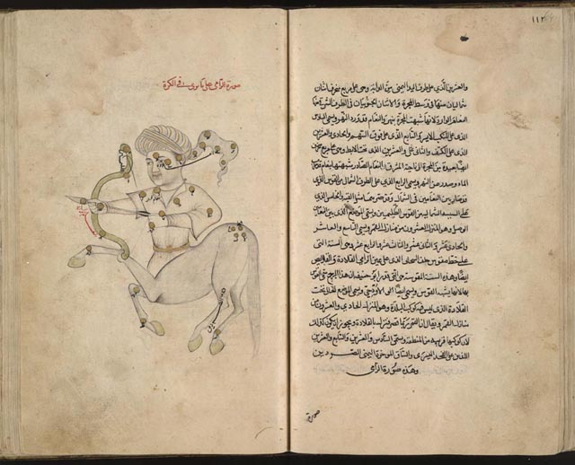
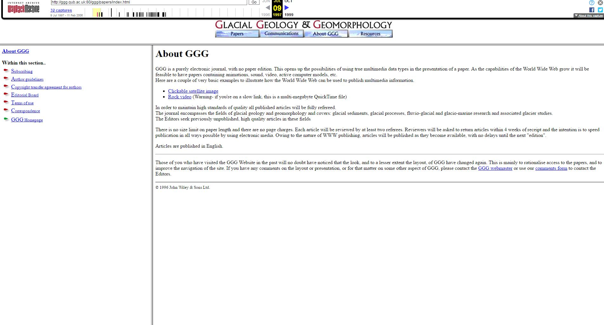
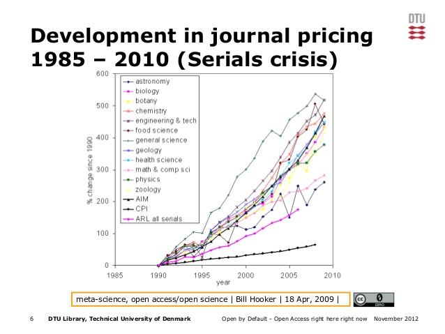

# Aims of session
- Provide an introduction to Open Science/Research
- Outline
- Develop some ideas of how to implement Open Science/Research
- Getting started - not the end of the process

---

# Schedule

|Topic   |Time   |
|--:|---|
|Open Science and Digital Scholarship   | 13:30 - 14:15   |
| Break   | 14:15 - 14:30   |
|Open Notebook Research   | 14:30 - 15:00  |
| Open Science Framework   | 15:00 - 15:30    |
| Break   | 15:30 - 15:45   |
|Setting up a notebook   | 15:45 -   |

# Definitions

## Open Science

> 'Open Science is the practice of science in such a way that others can collaborate and contribute, where research data, lab notes and other research processes are freely available, under terms that enable reuse, redistribution and reproduction of the research and its underlying data and methods.' - [Foster](https://www.fosteropenscience.eu/foster-taxonomy/open-science-definition)

---

# Open Science vs Open Research

> - Term developed to emphasize public funding of most scientific research
> - Open Science can be applied to all disciplines?
> - Open Research - if you don't want to call your research science

---

# Digital Scholarship

> - “Digital Scholarship” is defined as any scholarly activity that makes extensive use of one or more of the new possibilities for teaching and research opened up by the unique affordances of digital media. These include, but are not limited to, new forms of collaboration, new forms of publication, and new methods for visualizing and analyzing data. - Demystifying the Digital Humanities, University of Washington

> - 'Making effective use of new technologies'

---

# Why?

> - What are the motivations behind Open Science?
> - 'Negative' and 'positive' motivations
> - Technological drivers, social drivers, economic drivers

---

# A (brief) history of scientific dissemination

Technical changes that make more open science easier

---

# Medieval Scientific communication

The 10th century astronomer Abd al-Rahman al-Sufi (Azophi) carried out observations of the stars and described their positions, magnitudes, brightness, and colour and drawings for each constellation in his Book of Fixed Stars.

---

---

# The Printing Press

Johannes Gutenberg developed his printing press around 1440. The invention of mass printing has been termed the 'printing revolution' and is credited with contributing to social change.

---

# Internet publishing

>'GGG is a purely electronic journal, with no paper edition. This opens up the possibilities of using true multimedia data types in the presentation of a paper. As the capabilities of the World Wide Web grow it will be feasible to have papers containing animations, sound, video, active computer models, etc.' - http://ggg.qub.ac.uk:80/ggg/papers/index.html

---

# GGG Journal

---

# Barriers to access

 

---

> Paying for access to journals makes sense in the world of print publishing, where providing articles to each reader requires the production of physical copies of articles, but in the online world, with distribution as wide as the internet's reach, it makes much less sense. - https://www.plos.org/open-access/

---

# Open Access publishing

> - Open Access publishing address some of the issues around access to published research
> - Open Access monographs still in early stages
> - Open access publishing still largely mimics paper based publishing

---

# Open Science: motivations and drivers

## Negative drivers

> - A reproducibility crisis?

## Positive drivers

> - Research funders, government and university policies
> - Data access and reuse
> - Access (and recognition) for research software
> - Experiments with how to practice research

---

# A reproducibility crisis?

> - Claims that a number of disciplines have a reproducibility crisis
> - Difficulty in verifying results of published research
> - Lack of data, methods not clear, mistakes resulting from use of software, etc.

---

# Over half of psychology studies fail reproducibility test

> 'In the biggest project of its kind, Brian Nosek, a social psychologist and head of the Center for Open Science in Charlottesville, Virginia, and 269 co-authors repeated work reported in 98 original papers from three psychology journals, to see if they independently came up with the same results...only 39 of the 100 replication attempts were successful' -

https://www.nature.com/news/over-half-of-psychology-studies-fail-reproducibility-test-1.18248

---

# Why is there a reproducability crisis?

---

# Data

## Sluggish data sharing hampers reproducibility effort

> 'The Reproducibility Initiative: Cancer Biology consortium aims to repeat experiments from 50 highly-cited studies published in 2010–12 in journals such as Nature, Cell and Science, to see how easy it is to reproduce their findings. Although these journals require authors to share their data on request, it has taken two months on average to get the data for each paper...For one paper, securing the necessary data took a year. And the authors of four other papers have stopped communicating with the project altogether. In those instances, the journals that published the studies are stepping in to remind researchers of their responsibilities.' -

http://www.nature.com/news/sluggish-data-sharing-hampers-reproducibility-effort-1.17694

---

# Software

## Excel fail

> 'Harvard University economists Carmen Reinhart and Kenneth Rogoff have acknowledged making a spreadsheet calculation mistake in a 2010 research paper, “Growth in a Time of Debt” (PDF), which has been widely cited to justify budget-cutting. But the authors stand by their conclusion that higher government debt is associated with slower economic growth. Here’s what you need to know:'

https://www.bloomberg.com/news/articles/2013-04-18/faq-reinhart-rogoff-and-the-excel-error-that-changed-history

---
# Availability of code and software

> - Can you make sense of the data without code?
> - Is the code accessible?
> - How is it accessible? Binary vs source code
> - Research software is another valuable research output

---

# Open Science: funder policies

> - Majority of funders (and REF) require open access publising
> - Increasingly funders are enouraging the sharing of research data
> - Wellcome Open Science Prize and 'outputs management plan'
> - EU 2020 promtion of open science

---

# Open Science: data reuse

> - Data can be built on
> - A valuable research output
> - Examples: [nextstrain](http://www.nextstrain.org/), [UK Data Service](https://www.ukdataservice.ac.uk/use-data/data-in-use/case-study/?id=107), [Archeology Data Service](http://archaeologydataservice.ac.uk/)

---

# Open Science: research software

- Software and code increasingly important part of research
- Research software increasingly recognised as a valuable output
- [Depsy](http://depsy.org/)

---

# Methods and materials

- What are the other methods you used?
- Are materials used clear?
- http://oceanographyforeveryone.com/

---

# How to do open science?

- Make publication available open access (UCL Discovery, Gold Open Access)
- Make data associated with publications available (Discipline or general research data repository)
- Make software, code, scripts available
- Make the steps you took (documentation) available

---

# How to do open science: discussion?

- Pragmatic considerations?
- Motivations?
- Is it worth it?
- Barriers?

---

# Digital Scholarship?

> - A partial way of trying to address some of the above issues
> - New techniques for doing research
> - A method of pursuing more open science

---

# Research lifecycle: where to use new tools?

> - ideas
> - funding
> - data analysis
> - publication

# Assessing tools and approaches?

- Effort vs reward
- Can you keep your data?
- Costs

# Open notebooks?
